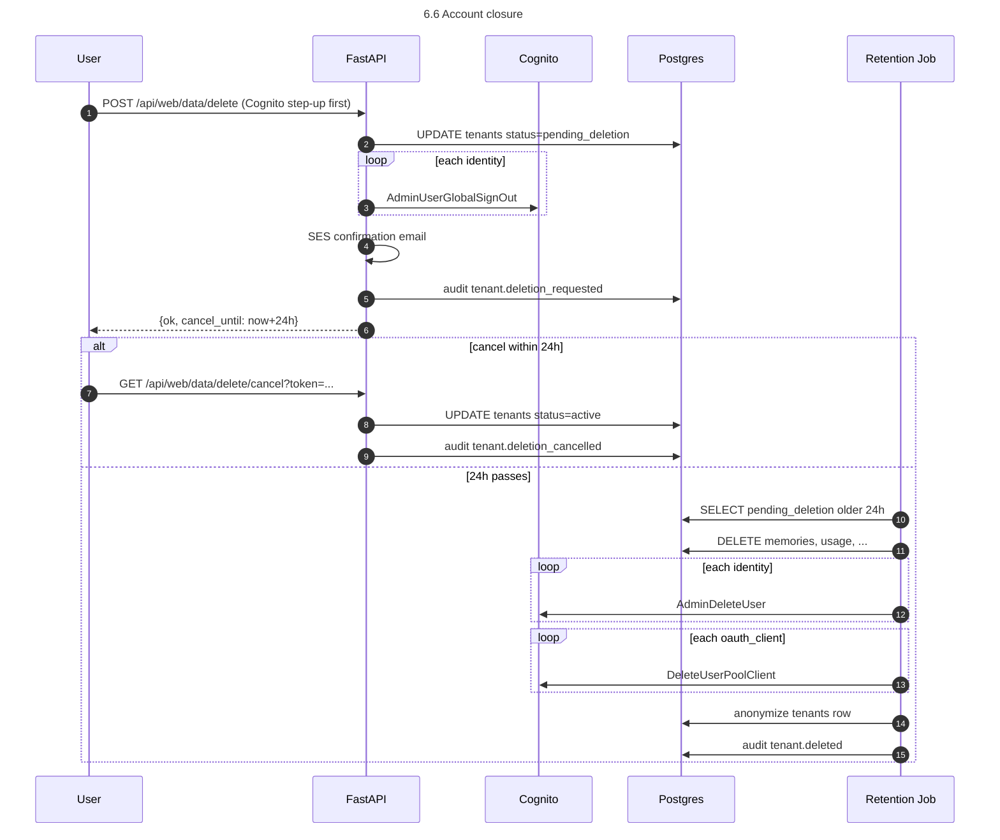

# Personal Memory MCP — Low-Level Design v1

**Status:** Draft v1, derived from `MEMORY_MCP_BUILD_PLAN_V2.md` (the canonical HLD/spec).
**Scope:** Adds implementation-level detail required to write code. Does not duplicate the spec; references §X.Y of the build plan instead.
**Companion:** `TASKS_V1.md` — GitHub-issue-ready task list aligned to this LLD.

---

## 0. Delta from `BUILD_PLAN_V2.md`

| Topic | Spec says | v1 LLD decision |
|---|---|---|
| IaC tool | Terraform (§4, §16) | **CloudFormation (CFT) + SAM** for Lambda |
| IdPs | Google + GitHub | **Google only** (GitHub deferred to v2) |
| Custom consent screen | Required (§6.7) | **Dropped** — Cognito Hosted UI direct |
| Link-mode signal to PreSignUp | "custom field" hand-wave (§7.4.4) | **Decided in `/auth/callback`**, not in PreSignUp |
| Token revocation on closure | "RevokeToken or disable clients" (§7.7.4) | **`AdminUserGlobalSignOut` per `cognito_sub`** + per-request `tenants.status` check |
| Email collision | Active concern (§7.3) | **Structurally impossible in v1** (single IdP). Code path is unreachable; tests skipped. |
| Email editability in Web UI | Display name editable (§12.3.6) | **Email also non-editable in v1** (deferred) |
| `oauth_consents` table | Active (§8.3) | **DDL kept, no writer**; v2-ready |
| Subdomains | `mem.<domain>`, `app.<domain>`, `auth.<domain>` | **`memsys.dheemantech.in`, `memapp.dheemantech.in`, `memauth.dheemantech.in`** |
| Ops email | Generic | `anand@dheemantech.com` |
| `oauth_clients.SupportedIdentityProviders` on DCR-create | `["COGNITO","Google","GitHub"]` (§6.5) | **`["Google"]`** only |
| Tenant creation moment | PreSignUp creates `tenants` row (FR-7.2.3) | **`/auth/callback` creates `tenants` row** after token exchange |

PreSignUp Lambda's job in v1 is only: "is this email on `invited_emails`?" — nothing else.

---

## 1. Architecture

### 1.1 Hostnames

```
memsys.dheemantech.in   →  Caddy :443 → uvicorn 127.0.0.1:8080  (mem-mcp FastAPI)
memapp.dheemantech.in   →  Caddy :443 → Next.js 127.0.0.1:8081  (web)
memauth.dheemantech.in  →  ALIAS → Cognito custom domain (Hosted UI)
```

### 1.2 Process inventory

| systemd unit | Port | Health |
|---|---|---|
| `postgresql.service` (Postgres 16 + pgvector + pg_trgm + pgcrypto) | 127.0.0.1:5432 | `pg_isready` |
| `mem-mcp.service` (uvicorn → `mem_mcp.main:app`) | 127.0.0.1:8080 | `/healthz`, `/readyz` |
| `mem-web.service` (`next start`) | 127.0.0.1:8081 | `/` |
| `caddy.service` | 0.0.0.0:443/80 | Caddy admin API |
| `*.timer` (×6) — retention, backup, DCR cleanup | n/a | Last-run audit |

Two FastAPI workers. Idempotency caches and rate-limit token buckets are per-worker (acceptable for v1).

### 1.3 OAuth flow

```
AI client ──► POST /mcp (no token) ──► 401 + WWW-Authenticate
AI client ──► GET  /.well-known/oauth-protected-resource
AI client ──► GET  /.well-known/oauth-authorization-server
AI client ──► POST /oauth/register                            (DCR shim)
AI client ──► browser → memauth/oauth2/authorize              (direct to Cognito; no consent interposition)
                       └─ Cognito Hosted UI: "Continue with Google"
                       └─ Google OAuth roundtrip
                       └─ Cognito issues code → AI client redirect_uri
AI client ──► POST memauth/oauth2/token                       (PKCE)
AI client ──► POST /mcp (Bearer access_token)
              ├─ JWT validator (JWKS-cached)
              ├─ tenant resolver (cognito_sub → tenants)
              ├─ tenant_tx (SET LOCAL app.current_tenant_id)
              └─ tool dispatch
```

Web sign-in uses the same Cognito Hosted UI; tenant creation and identity linking decisions happen in `memapp/auth/callback`.

---

## 2. CloudFormation infrastructure

### 2.1 Stack hierarchy

Root stack with nested stacks, deployed via **AWS SAM CLI**.

```
infra/cfn/
├── README.md
├── samconfig.toml
├── root.yaml
├── nested/
│   ├── 010-network.yaml              # VPC, subnet, IGW, RT, SG
│   ├── 020-secrets.yaml              # KMS CMK, SSM placeholders
│   ├── 030-storage.yaml              # S3 backup bucket + policy + lifecycle
│   ├── 040-identity.yaml             # Cognito user pool, custom domain, resource server, Google IdP, web app client
│   ├── 050-lambda-presignup.yaml     # SAM Function (Python 3.12) + Cognito trigger permission
│   ├── 060-compute.yaml              # IAM instance profile, EC2 t4g.medium, EBS gp3, EIP
│   ├── 070-dns.yaml                  # Route 53 records
│   ├── 080-observability.yaml        # CloudWatch log groups, alarms, dashboard, SNS
│   └── 090-bootstrap-bucket.yaml     # (one-time) S3 bucket holding nested templates + Lambda zip
└── parameters/
    ├── prod.json
    └── staging.json
```

ACM cert for Cognito custom domain lives in `us-east-1` — separate stack `infra/cfn/us-east-1/cert.yaml`.

Order:
1. Deploy `090-bootstrap-bucket.yaml` (one-time).
2. `aws s3 sync infra/cfn/nested/ s3://mem-mcp-cfn-.../nested/`.
3. `sam deploy` root.

### 2.2 Parameters (root stack)

| Parameter | Example |
|---|---|
| `DomainName` | `dheemantech.in` |
| `MemSysSubdomain` / `MemAppSubdomain` / `MemAuthSubdomain` | `memsys` / `memapp` / `memauth` |
| `OperatorEmail` | `anand@dheemantech.com` |
| `OperatorIpCidr` | `203.0.113.45/32` |
| `Ec2KeyName` / `Ec2InstanceType` | `mem-mcp-ops` / `t4g.medium` |
| `BackupRetentionDays` / `LogRetentionDays` / `AuditLogRetentionDays` | `730` / `30` / `90` |
| `BootstrapBucketName` | `mem-mcp-cfn-${Acct}-aps1` |
| `UsEast1CertArn` | `arn:aws:acm:us-east-1:...` |
| `GoogleClientIdSsmName` / `GoogleClientSecretSsmName` | `/mem-mcp/cognito/google_client_id` / `_secret` |

Secrets stay in SSM SecureString. CFT references via `'{{resolve:ssm-secure:/mem-mcp/cognito/google_client_secret:1}}'` (versioned).

### 2.3 Cross-stack outputs

Nested-stack outputs surfaced via `Outputs:`; root consumes via `Fn::GetAtt NestedStack.Outputs.X`. **No `Fn::ImportValue`**.

| Output | From | Used by |
|---|---|---|
| `Ec2InstanceId`, `ElasticIp` | 060-compute | DNS, operator |
| `CognitoUserPoolId`, `CognitoUserPoolDomain`, `CognitoWebClientId` | 040-identity | EC2 user-data → SSM |
| `BackupBucketName` | 030-storage | EC2 user-data → SSM |
| `KmsKeyId` | 020-secrets | EC2 instance role |
| `OpsSnsTopicArn` | 080-observability | future alarm stacks |

CFT writes these into SSM as `String` parameters during deploy; EC2 user-data reads at boot.

### 2.4 Manual prerequisites (NOT in CFT)

| Item | Step |
|---|---|
| Bedrock model access for `amazon.titan-embed-text-v2:0` | Console → Model access → Request access |
| SES domain identity verification | Console + DNS records (CFT can place records via Route 53) |
| SES sandbox removal | AWS support ticket |
| Google Cloud OAuth client | Google Console → Create OAuth 2.0 client; record id+secret in SSM |
| Domain registration | Already owned |
| Route 53 hosted zone | Pass `HostedZoneId` as parameter if pre-existing |

Each as a one-line entry in `infra/cfn/README.md` "Pre-deploy checklist".

### 2.5 Lambda packaging via SAM

```yaml
Transform: AWS::Serverless-2016-10-31
Resources:
  PreSignUpFn:
    Type: AWS::Serverless::Function
    Properties:
      FunctionName: mem-mcp-presignup
      Runtime: python3.12
      Architectures: [arm64]
      Handler: handler.lambda_handler
      CodeUri: ../../../lambdas/presignup/
      MemorySize: 256
      Timeout: 5
      Environment:
        Variables:
          INTERNAL_INVITE_URL: !Sub 'https://${MemSysSubdomain}.${DomainName}/internal/check_invite'
          INTERNAL_INVITE_SECRET_SSM: '/mem-mcp/internal/lambda_shared_secret'
      Policies:
        - Statement:
            - Effect: Allow
              Action: ssm:GetParameter
              Resource: !Sub 'arn:aws:ssm:${AWS::Region}:${AWS::AccountId}:parameter/mem-mcp/internal/lambda_shared_secret'
            - Effect: Allow
              Action: kms:Decrypt
              Resource: !Ref KmsKeyArn
```

`AWS::Lambda::Permission` allows Cognito to invoke. PreSignUp wired in `040-identity.yaml` via `LambdaConfig`.

Lambda has **no VPC config** in v1 — calls public `https://memsys.dheemantech.in/internal/check_invite`.

### 2.6 Deploy commands

```bash
# One-time
aws cloudformation deploy --template-file infra/cfn/nested/090-bootstrap-bucket.yaml \
  --stack-name mem-mcp-cfn-bootstrap --capabilities CAPABILITY_NAMED_IAM --region ap-south-1

aws cloudformation deploy --template-file infra/cfn/us-east-1/cert.yaml \
  --stack-name mem-mcp-cert-use1 --region us-east-1 \
  --parameter-overrides DomainName=dheemantech.in MemAuthSubdomain=memauth

# Every deploy
sam deploy --template-file infra/cfn/root.yaml --stack-name mem-mcp-prod \
  --s3-bucket mem-mcp-cfn-${ACCOUNT}-aps1 --s3-prefix sam-pkg \
  --capabilities CAPABILITY_NAMED_IAM CAPABILITY_AUTO_EXPAND \
  --parameter-overrides $(cat infra/cfn/parameters/prod.json | jq -r 'to_entries|map("\(.key)=\(.value|tostring)")|join(" ")') \
  --region ap-south-1 --no-fail-on-empty-changeset
```

---

## 3. Infrastructure destruction plan

### 3.1 Pre-destroy checklist

1. Final backup via `pg_dump_to_s3.sh`.
2. Download backup locally.
3. Fulfill any pending DPDP exports.
4. Notify users (7-day notice).
5. Final EBS snapshot OR confirm latest daily snap < 24h.

### 3.2 Destroy script (`deploy/scripts/destroy.sh`)

Idempotent steps:

```
Step 1:  SAFETY GATE — DESTROY_CONFIRM=mem-mcp-prod-yes-i-mean-it + interactive "yes"
Step 2:  DRAIN COGNITO USERS — list + AdminDeleteUser per user
Step 3:  DRAIN DCR-CREATED CLIENTS — list + DeleteUserPoolClient (skip CFT-tagged)
Step 4:  EMPTY S3 BACKUP BUCKET — including all object versions and delete markers
Step 5:  EMPTY CFN BOOTSTRAP BUCKET
Step 6:  DISABLE EC2 TERMINATION PROTECTION
Step 7:  delete-stack mem-mcp-prod (wait stack-delete-complete)
Step 8:  delete-stack mem-mcp-cert-use1 --region us-east-1
Step 9:  delete-stack mem-mcp-cfn-bootstrap
Step 10: KMS schedule-key-deletion --pending-window-in-days 30
Step 11: ORPHAN CHECK — describe instances/buckets/user-pools/SSM filtered by tag/prefix; non-zero exit on hits
```

### 3.3 NOT auto-destroyed

| Resource | Operator action |
|---|---|
| Route 53 hosted zone | Manual delete only when retiring domain |
| EBS snapshots (daily policy) | `aws ec2 delete-snapshot` if winding down |
| SSM parameters under `/mem-mcp/*` | Manual `delete-parameters` |
| CloudTrail logs | Leave for compliance |
| SES domain identity & DKIM | Manual cleanup if retiring |
| Bedrock model access | Free; leave |
| Google Cloud OAuth client | Manual delete in Google Console |

### 3.4 Verification

24h after `destroy.sh`:

```bash
aws ce get-cost-and-usage --time-period Start=$(date -d '24h ago' +%F),End=$(date +%F) \
  --granularity DAILY --metrics UnblendedCost \
  --filter '{"Tags":{"Key":"Project","Values":["mem-mcp"]}}'
```

Expected `$0.00` (modulo KMS/snapshot/CloudTrail tail). `verify_destroy.sh` exits non-zero if cost > 0 or any resource lingers.

### 3.5 Partial-destroy

- **Keep DB only**: stop services, `pg_dump` to S3, full destroy, restore on new host.
- **Keep S3 backups**: `DeletionPolicy: Retain` on backup bucket.
- **Keep Cognito users (rare)**: skip Step 2; export users to JSON before destroy.

Documented in `docs/runbooks/destroy_partial.md`.

---

## 4. Backend module design

### 4.1 `mem_mcp.config`

```python
class Settings(BaseSettings):
    model_config = SettingsConfigDict(env_prefix="MEM_MCP_", frozen=True)
    region: str = "ap-south-1"
    db_dsn: str
    db_maint_dsn: str
    cognito_user_pool_id: str
    cognito_domain: str                  # memauth.dheemantech.in
    resource_url: str                    # https://memsys.dheemantech.in
    web_url: str                         # https://memapp.dheemantech.in
    web_client_id: str
    web_client_secret: str               # SecureString
    internal_lambda_secret: str          # SecureString
    ses_from: str
    backup_bucket: str
    backup_gpg_passphrase: str           # SecureString
    web_session_secret: str              # SecureString
    link_state_secret: str               # SecureString
    bedrock_model_id: str = "amazon.titan-embed-text-v2:0"
    log_level: str = "INFO"

@lru_cache(maxsize=1)
def get_settings() -> Settings: ...
```

**SSM rule**: at process start, one `GetParametersByPath('/mem-mcp/', WithDecryption=true)` populates env-style dict; then `Settings()` constructed; SSM client closed.

### 4.2 `mem_mcp.db`

```python
async def init_pool() -> asyncpg.Pool: ...
async def close_pool() -> None: ...
def get_pool() -> asyncpg.Pool: ...

@contextlib.asynccontextmanager
async def tenant_tx(pool, tenant_id: UUID):
    async with pool.acquire() as conn:
        async with conn.transaction():
            await conn.execute(
                "SELECT set_config('app.current_tenant_id', $1, true)",
                str(tenant_id))
            yield conn

@contextlib.asynccontextmanager
async def system_tx(pool):
    """Maintenance path; mem_maint role only."""
    async with pool.acquire() as conn:
        async with conn.transaction():
            yield conn
```

### 4.3 `mem_mcp.auth`

```
auth/
├── jwks.py              # async fetch + cache (1h TTL, refresh on kid miss)
├── jwt_validator.py     # validate(token) -> JwtClaims
├── middleware.py        # Bearer middleware → request.state.tenant_ctx
├── well_known.py        # /.well-known/oauth-{protected-resource,authorization-server}
├── dcr.py               # POST /oauth/register
├── dcr_admin.py         # GET/DELETE /oauth/register/{client_id}
└── internal_invite.py   # POST /internal/check_invite (HMAC)
```

```python
@dataclass(frozen=True)
class JwtClaims:
    sub: str; iss: str; aud: str | None
    client_id: str; scopes: tuple[str, ...]
    exp: int; iat: int; token_use: str

class JwtError(Exception):
    code: str   # 'expired'|'bad_signature'|'wrong_iss'|'wrong_aud'|'missing_claim'

async def validate(token: str) -> JwtClaims: ...
```

`python-jose[cryptography]` for JWS. JWKS via httpx async; refresh cache on `kid` miss before failing.

**Bearer middleware status mapping:**

| `tenants.status` | HTTP | Body |
|---|---|---|
| `active` | (continue) | — |
| `suspended` | 403 | `{"error":"account_suspended"}` |
| `pending_deletion` | 403 | `{"error":"account_deletion_pending"}` |
| `deleted` / not found | 401 | `{"error":"invalid_token"}` |

`TenantContext` includes `tenant_id, identity_id, client_id, scopes`. Middleware also updates `tenant_identities.last_seen_at` and `oauth_clients.last_used_at` best-effort.

**DCR shim** Pydantic:

```python
class DcrInput(BaseModel):
    client_name: str = Field(..., max_length=128)
    client_uri: str | None = None
    redirect_uris: list[str] = Field(..., min_length=1, max_length=5)
    grant_types: list[Literal["authorization_code","refresh_token"]] = ["authorization_code","refresh_token"]
    response_types: list[Literal["code"]] = ["code"]
    token_endpoint_auth_method: Literal["none"] = "none"
    scope: str = "memory.read memory.write"
    software_id: str
    software_version: str | None = None

class DcrOutput(BaseModel):
    client_id: str; client_id_issued_at: int; client_secret_expires_at: int = 0
    redirect_uris: list[str]; grant_types: list[str]; response_types: list[str]
    token_endpoint_auth_method: str; scope: str
    registration_access_token: str        # one-time plaintext; persist sha256
    registration_client_uri: str
```

`SupportedIdentityProviders=['Google']` on `CreateUserPoolClient` (v1 only).

### 4.4 `mem_mcp.embeddings.bedrock`

```python
class EmbeddingError(Exception):
    code: Literal["throttled","unavailable","invalid_input"]
    retry_after_seconds: int = 0

@dataclass
class EmbedResult:
    vector: list[float]   # length 1024
    input_tokens: int

async def embed(text: str) -> EmbedResult: ...
```

Tenacity 3-attempt expo backoff (200ms/800ms/3.2s). `boto3` + `asyncio.to_thread`. Invalid input (len 0 or > 50k) → `invalid_input`.

### 4.5 `mem_mcp.memory`

```
memory/
├── normalize.py        # normalize_for_hash, hash_content
├── dedupe.py           # check_dup → Optional[(UUID, kind)]
├── hybrid_query.py     # hybrid_search using SQL §10.3
└── versioning.py       # supersede helper
```

```python
def normalize_for_hash(text: str) -> str:
    t = unicodedata.normalize("NFKC", text).strip().lower()
    return re.sub(r"\s+", " ", t)

def hash_content(text: str) -> str:
    return hashlib.sha256(normalize_for_hash(text).encode("utf-8")).hexdigest()

async def check_dup(conn, tenant_id, content_hash, embedding, type_):
    row = await conn.fetchrow(
        """SELECT id FROM memories
           WHERE tenant_id=$1 AND content_hash=$2
             AND deleted_at IS NULL AND is_current=true LIMIT 1""",
        tenant_id, content_hash)
    if row: return (row["id"], "hash")
    if embedding is None: return None
    row = await conn.fetchrow(
        """SELECT id, 1-(embedding<=>$3::vector) AS sim FROM memories
           WHERE tenant_id=$1 AND type=$2
             AND deleted_at IS NULL AND is_current=true
           ORDER BY embedding<=>$3::vector LIMIT 1""",
        tenant_id, type_, embedding)
    if row and row["sim"] > 0.95: return (row["id"], "embedding")
    return None
```

Hybrid search uses spec §10.3 SQL verbatim.

### 4.6 `mem_mcp.mcp`

```
mcp/
├── transport.py        # POST /mcp dispatcher; JSON-RPC 2.0 + SSE on demand
├── registry.py         # ToolDef registry; per-tool scope
├── errors.py           # to_jsonrpc_error
└── tools/_base.py + write/search/get/list/update/delete/undelete/supersede/export/stats/feedback.py
```

`BaseTool`: `name, required_scope, InputModel, OutputModel, __call__(ctx, inp)`. `tools/list` built from `Pydantic.model_json_schema()`.

Example `memory.write` Pydantic:

```python
class MemoryWriteInput(BaseModel):
    model_config = ConfigDict(extra="forbid")
    content: str = Field(..., min_length=1, max_length=32_768)
    type: Literal["note","decision","fact","snippet","question"] = "note"
    tags: list[str] = Field(default_factory=list, max_length=32)
    metadata: dict[str, Any] = Field(default_factory=dict)
    supersedes: UUID | None = None
    force_new: bool = False

    @field_validator("tags", mode="after")
    @classmethod
    def _vt(cls, v):
        for t in v:
            if not 1 <= len(t) <= 64: raise ValueError("tag length")
            if not re.match(r"^[a-zA-Z0-9_:.-]+$", t): raise ValueError("tag chars")
        if len(set(v)) != len(v): raise ValueError("dup tags")
        return v

class MemoryWriteOutput(BaseModel):
    id: UUID; version: int; deduped: bool
    merged_into: UUID | None
    created_at: datetime; request_id: str
```

Other tools mechanically derived from spec §9.3.

### 4.7 `mem_mcp.quotas`

```python
class TierLimits(BaseModel):
    memories_limit: int; embed_tokens_daily: int
    writes_per_minute: int; reads_per_minute: int

TIERS: dict[str, TierLimits] = ...   # spec §11.1

class QuotaError(Exception):
    quota: Literal["memories_count","embed_tokens_daily","writes_per_minute","reads_per_minute"]
    reset_at: datetime; tier: str

async def check_write(conn, ctx, content_len_estimate: int) -> None: ...
async def check_read(conn, ctx) -> None: ...
async def increment_write(conn, ctx, embed_tokens: int) -> None: ...
async def increment_read(conn, ctx, embed_tokens: int) -> None: ...
```

Per-minute → in-process token bucket. Per-day → `tenant_daily_usage`.

### 4.8 `mem_mcp.ratelimit.token_bucket`

```python
class TokenBucket:
    def __init__(self, capacity: int, refill_per_sec: float): ...
    def try_take(self, n: int = 1) -> bool: ...
    def time_to_next(self, n: int = 1) -> float: ...

_buckets: dict[str, TokenBucket] = {}   # 'tenant:<uuid>:write' / 'ip:<addr>:dcr'
```

Per-process. With 2 workers the effective ceiling is 2× declared.

### 4.9 `mem_mcp.audit.logger`

```python
async def audit(conn, *, action, result, tenant_id, identity_id=None,
                client_id=None, target_id=None, target_kind=None,
                ip_address=None, user_agent=None, request_id=None,
                error_code=None, details=None) -> None:
    """INSERT into audit_log on the SAME connection as the operation, so audit rolls back with the tx.
       Auth-failure audits use a fresh system_tx."""
```

### 4.10 `mem_mcp.identity`

```
identity/
├── tenant_resolver.py     # cognito_sub → (tenant_id, identity_id)
├── linking.py             # start_link / complete_link
├── unlinking.py           # unlink / promote_primary
├── lifecycle.py           # request/cancel/finalize_closure
└── tenant_create.py       # ensure_tenant_for_first_signin
```

**Linking flow:**

```
POST /api/web/identities/link/start  (auth: web session for T1)
  └─ generate nonce; HMAC-sign(state = {tid:T1, nonce, exp})
  └─ INSERT INTO link_state (nonce, tenant_id, expires_at)
  └─ return Cognito authorize URL with state=<signed_state>
  └─ short-lived link_state_cookie (httpOnly, 10min)

GET /auth/callback?code=...&state=...
  └─ Token exchange; extract cognito_sub
  └─ Verify state HMAC + cookie nonce + session is T1 + link_state row valid+unconsumed
  └─ INSERT INTO tenant_identities (T1, new_sub, primary=false)
  └─ UPDATE link_state SET consumed_at=now()
  └─ audit identity.linked
  └─ redirect /settings/identities?linked=ok
```

**First sign-in flow:**

```
GET /auth/callback
  └─ Token exchange; extract cognito_sub + email
  └─ SELECT tenant_id FROM tenant_identities WHERE cognito_sub=?
       ├─ HIT  → existing user; create web session; redirect /dashboard
       └─ MISS:
           ├─ if state matches link_state → linking flow
           └─ else (invitation-driven):
               ├─ INSERT tenants(email)
               ├─ INSERT tenant_identities(...primary)
               ├─ UPDATE invited_emails SET consumed_at=now()
               ├─ audit tenant.created
               ├─ create web session; redirect /welcome
```

### 4.11 `mem_mcp.web`

```
web/
├── routes.py        # /api/web/* and /auth/* routers
├── sessions.py      # opaque session id → web_sessions row (sha256 stored)
├── csrf.py          # double-submit cookie pattern
└── handlers/        # one module per page or domain
```

**Session**: cookie `mem_session` (HttpOnly, Secure, SameSite=Lax, 7d). Value 32 bytes urlsafe; DB key `sha256(value)`. `last_seen_at` updated if > 60s old.

**CSRF**: POST/PATCH/DELETE require `X-CSRF-Token` header == `csrf_token` cookie (random 32B, JS-readable, SameSite=Lax). Mismatch → 403.

### 4.12 `mem_mcp.jobs`

```
jobs/
├── retention_memories.py      # soft + hard delete
├── retention_tokens.py        # purge expired link_state, web_sessions
├── retention_audit.py         # anonymize 90d-post-deletion; hard-delete 730d
├── retention_deletion.py      # finalize tenants pending_deletion > 24h
├── cleanup_clients.py         # delete unused Cognito clients
├── backup_check.py            # alarm if last backup > 36h
└── _runner.py                 # CLI: python -m mem_mcp.jobs <name> [--dry-run]
```

Each uses `MEM_MCP_DB_MAINT_DSN`, `system_tx`, emits CloudWatch metric.

---

## 5. Database design

### 5.1 DDL deltas from spec §8.3

- `oauth_consents` — DDL kept; **no writer in v1**. Migration comment `-- v2-ready, unused in v1`.
- `tenant_identities.provider` CHECK relaxed to `IN ('google','cognito')` for v1.

### 5.2 Migration order

```
0001_initial_schema.py         — full DDL (with v1 CHECK on provider)
0002_seed_allowed_software.py  — Anthropic + OpenAI status='allowed', others 'blocked'
```

Invitations seeded via `deploy/scripts/seed_invite.py` CLI (not a migration).

### 5.3 Roles + grants

`deploy/postgres/init_roles.sql` (run once as superuser via local socket):

```sql
CREATE ROLE mem_app   LOGIN PASSWORD :'mem_app_password';
CREATE ROLE mem_maint LOGIN PASSWORD :'mem_maint_password' BYPASSRLS;
CREATE DATABASE mem_mcp OWNER mem_maint;

\connect mem_mcp
GRANT CONNECT ON DATABASE mem_mcp TO mem_app;
GRANT USAGE ON SCHEMA public TO mem_app, mem_maint;
ALTER DEFAULT PRIVILEGES IN SCHEMA public
  GRANT SELECT, INSERT, UPDATE, DELETE ON TABLES TO mem_app;
ALTER DEFAULT PRIVILEGES IN SCHEMA public
  GRANT USAGE, SELECT ON SEQUENCES TO mem_app;
```

### 5.4 RLS

`ENABLED` and `FORCED`. `mem_maint` has `BYPASSRLS`; `mem_app` does NOT.

### 5.5 Indexes

- `idx_memories_embedding` (HNSW m=16, ef_construction=64). Tune ef_construction → 200 if recall feels low.
- Partial GIN on `content_tsv`/`tags` (predicate `deleted_at IS NULL AND is_current=true`).
- `pg_stat_statements` enabled.

---

## 6. Sequence diagrams

```mermaid
sequenceDiagram
  autonumber
  title 6.1 First-time sign-in (invitation honored, new tenant)
  participant U as User
  participant W as Next.js
  participant F as FastAPI
  participant C as Cognito
  participant L as PreSignUp Lambda
  participant D as Postgres

  U->>W: GET /
  W->>U: Click "Sign in"
  U->>F: GET /auth/login
  F->>U: 302 to memauth/oauth2/authorize
  U->>C: GET /oauth2/authorize
  C->>U: "Continue with Google"
  U->>C: Choose Google → Google OAuth
  C->>L: PreSignUp event {email}
  L->>F: POST /internal/check_invite (HMAC)
  F->>D: SELECT FROM invited_emails WHERE email=?
  F-->>L: {decision:"allow"}
  L-->>C: allow
  C->>U: 302 to memapp/auth/callback?code=...
  U->>F: GET /auth/callback?code=...
  F->>C: POST /oauth2/token
  C-->>F: {access_token, id_token, refresh_token}
  F->>D: SELECT tenant_identities WHERE cognito_sub=? (none)
  F->>D: INSERT tenants; INSERT tenant_identities (primary)
  F->>D: UPDATE invited_emails consumed_at=now()
  F->>D: audit tenant.created
  F->>F: Create web session + cookie
  F->>U: 302 /welcome
```

```mermaid
sequenceDiagram
  autonumber
  title 6.2 Identity link
  participant U as User
  participant W as Next.js
  participant F as FastAPI
  participant C as Cognito
  participant D as Postgres

  U->>W: /settings/identities → "Add another"
  W->>F: POST /api/web/identities/link/start (cookie:T1)
  F->>F: nonce + HMAC-sign state {tid:T1,nonce,exp}
  F->>D: INSERT link_state
  F-->>W: {authorize_url, link_state_cookie}
  W->>U: 302 + Set-Cookie
  U->>C: /oauth2/authorize?state=signed
  C->>U: Google sign-in (different account)
  C->>U: 302 /auth/callback?code=...&state=signed
  U->>F: GET /auth/callback (T1 + link_state_cookie)
  F->>F: Verify state HMAC; nonce==cookie; session==T1
  F->>C: token exchange → new cognito_sub
  F->>D: SELECT tenant_identities (none)
  F->>D: SELECT link_state unconsumed exp>now()
  F->>D: INSERT tenant_identities (T1, new_sub, primary=false)
  F->>D: UPDATE link_state consumed_at=now()
  F->>D: audit identity.linked
  F->>U: 302 /settings/identities?linked=ok
```

```mermaid
sequenceDiagram
  autonumber
  title 6.3 DCR + first AI-client call
  participant A as AI Client
  participant F as FastAPI
  participant C as Cognito

  A->>F: POST /mcp (no token)
  F-->>A: 401 + WWW-Authenticate
  A->>F: GET /.well-known/oauth-protected-resource
  F-->>A: {resource, authorization_servers}
  A->>F: GET /.well-known/oauth-authorization-server
  F-->>A: AS metadata
  A->>F: POST /oauth/register
  F->>F: Validate (allowlist, scheme, rate-limit)
  F->>C: cognito-idp:CreateUserPoolClient
  C-->>F: {ClientId}
  F->>F: INSERT oauth_clients; mint registration_access_token
  F-->>A: RFC 7591 response
  A->>A: Browser → memauth/oauth2/authorize&PKCE
  Note over A,C: User completes Google sign-in
  A->>C: POST /oauth2/token
  C-->>A: {access_token, refresh_token}
  A->>F: POST /mcp (Bearer)
  F-->>A: tools/list
```

```mermaid
sequenceDiagram
  autonumber
  title 6.4 memory.write (dedupe + versioning)
  participant A as AI Client
  participant F as FastAPI
  participant B as Bedrock
  participant D as Postgres

  A->>F: POST /mcp (memory.write)
  F->>F: Bearer mw → tenant_ctx
  F->>D: tenant_tx → status + quota check
  F->>F: hash = sha256(normalize(content))
  F->>D: SELECT id WHERE content_hash=?
  alt exact hash match
    F->>D: UPDATE tags ∪ new
    F->>D: audit dedupe_merged
    F-->>A: {deduped:true}
  else no hash
    F->>B: embed(content)
    B-->>F: {embedding, tokens}
    F->>D: nearest by cosine
    alt sim>0.95 same type
      F->>D: UPDATE tags ∪ new
      F->>D: audit dedupe_merged (embedding)
      F-->>A: {deduped:true}
    else
      alt supersedes provided
        F->>D: INSERT new (v=old+1, supersedes); UPDATE old (is_current=false)
        F->>D: audit memory.supersede
      else
        F->>D: INSERT new memory
      end
      F->>D: usage += embed_tokens, writes_count++
      F->>D: audit memory.write
      F-->>A: {id, version, deduped:false}
    end
  end
```

```mermaid
sequenceDiagram
  autonumber
  title 6.5 memory.search (hybrid)
  participant A as AI Client
  participant F as FastAPI
  participant B as Bedrock
  participant D as Postgres

  A->>F: POST /mcp (memory.search)
  F->>F: Bearer → tenant_ctx; read quota check
  F->>B: embed(query)
  B-->>F: {qvec, qtokens}
  F->>D: tenant_tx → hybrid SQL §10.3
  D-->>F: ranked rows
  F->>D: usage += qtokens, reads_count++
  F->>D: audit memory.search
  F-->>A: {results, query_embedding_tokens, request_id}
```



---

## 7. State machines

### 7.1 Tenant

```
            ┌──────────┐
            │  active  │◄──────────────────────┐
            └────┬──┬──┘                       │
   request close│  │suspend (operator)         │ cancel within 24h
                ▼  ▼                           │
       ┌─────────────────────┐    operator     │
       │ pending_deletion    ├─── unsuspend ───┤
       └─────────┬───────────┘                 │
        24h job  │ finalize                    │
                 ▼                             │
            ┌─────────┐                        │
            │ deleted │                        │
            └─────────┘                        │
            ┌────────────┐                     │
            │ suspended  ├─────────────────────┘
            └────────────┘
```

Allowed transitions only; any other attempt → 409.

### 7.2 Memory

```
              ┌──────────────┐
              │    live      │
              │ is_current=t │
              │ deleted_at=∅ │
              └──┬────────┬──┘
        soft del │        │ supersede (versioned only)
                 ▼        ▼
       ┌──────────────┐  ┌──────────────┐
       │ soft-deleted │  │  superseded  │
       │ deleted_at>∅ │  │ is_current=f │
       └──────┬───────┘  └──────┬───────┘
   undelete   │                 │
   (≤30d) ◄───┤                 │ explicit "delete all versions"
              │ +30d            │
              ▼                 ▼
        ┌─────────────────────────┐
        │     hard-deleted        │
        └─────────────────────────┘
```

### 7.3 OAuth client

```
   created (DCR) → review_status='auto_allowed', disabled=false
        │  user revokes via web UI
        ▼
   disabled=true → cleanup job → DELETE row + Cognito client
                                  (90d unused OR explicit revoke)
```

---

## 8. Web app (Next.js)

### 8.1 Page → API map

| Route | Type | Server Action / API |
|---|---|---|
| `/` | server | static |
| `/welcome` | server | `/api/web/me` |
| `/dashboard` | server | `/api/web/stats` |
| `/memories` | server + client | `/api/web/memories?...` |
| `/memories/[id]` | server | `/api/web/memories/{id}` |
| `/settings` | server | `/api/web/me`, `PATCH /api/web/tenant` |
| `/settings/identities` | server + client | `/api/web/identities/*` |
| `/settings/applications` | server | `/api/web/clients/*` |
| `/settings/feedback` | client | `/api/web/feedback` |
| `/data/export` | server | streams `/api/web/data/export` |
| `/data/delete` | server + client | `/api/web/data/delete{,/cancel}` |
| `/skills` | static | none |
| `/legal/privacy`, `/legal/terms` | static | none |
| `/auth/login` | server route | 302 to Cognito |
| `/auth/callback` | server route | exchange + session |
| `/auth/logout` | server action | revoke + clear |

### 8.2 Caddy path routing (single origin)

```
memapp.dheemantech.in {
  @apiweb path /api/web/* /auth/*
  reverse_proxy @apiweb 127.0.0.1:8080
  reverse_proxy 127.0.0.1:8081
}
```

---

## 9. Skills

```
skills/
├── mem-capture/{SKILL.md, meta.yaml}
└── mem-recall/{SKILL.md, meta.yaml}
```

`meta.yaml` carries `connector_url: https://memsys.dheemantech.in/mcp`, scopes, install command.

---

## 10. Operations

### 10.1 Bootstrap

Idempotent on first boot:
1. SSM `/mem-mcp/*` → `/etc/mem-mcp/env`
2. `init_roles.sql`
3. `poetry install` + `alembic upgrade head`
4. `pnpm install && pnpm build`
5. `systemctl enable + start` services + timers
6. Wait `/healthz`; emit `mem_mcp.bootstrap.success=1`

### 10.2 Deploy

`git pull` → `poetry install` → `alembic upgrade head` → `pnpm build` → `systemctl restart` → wait `/readyz`.

### 10.3 Backup (`pg_dump_to_s3.sh`)

```bash
set -euo pipefail
DATE=$(date -u +%FT%H%M%SZ)
TMP=$(mktemp /tmp/mem-mcp.XXXXXX.dump)
GPG=$(mktemp /tmp/mem-mcp.XXXXXX.gpg)
pg_dump --format=custom --compress=9 --dbname="$MEM_MCP_DB_MAINT_DSN" --file="$TMP"
PASS=$(aws ssm get-parameter --with-decryption --name /mem-mcp/backup/gpg_passphrase \
  --query 'Parameter.Value' --output text)
echo "$PASS" | gpg --batch --yes --passphrase-fd 0 --cipher-algo AES256 --symmetric \
  --output "$GPG" "$TMP"
aws s3 cp "$GPG" "s3://${MEM_MCP_BACKUP_BUCKET}/db/${DATE}.dump.gpg" \
  --sse aws:kms --sse-kms-key-id "$MEM_MCP_KMS_KEY_ID" \
  --metadata "sha256=$(sha256sum "$GPG" | cut -d' ' -f1)"
shred -u "$TMP" "$GPG"
aws cloudwatch put-metric-data --namespace mem-mcp --metric-name backup.success --value 1
```

### 10.4 Retention skeleton

```python
async def main(dry_run: bool = False) -> int:
    pool = await init_maintenance_pool()
    affected = 0
    async with system_tx(pool) as conn:
        rows = await conn.fetch(SELECT_TARGETS, ...)
        for r in rows:
            if dry_run: continue
            await conn.execute(MUTATE, r["id"])
            affected += 1
    log.info("job_done", job=__name__, affected=affected, dry_run=dry_run)
    metric("mem_mcp.retention.<name>.affected", affected)
    return 0
```

### 10.5 Alarms (CFT)

All in `080-observability.yaml`. `AWS::Logs::MetricFilter` → `AWS::CloudWatch::Alarm`. Synthetic tenant-isolation alarm fires hourly via SSM Run Command.

---

## 11. Testing harness

```python
@pytest.fixture
async def pg_pool() -> asyncpg.Pool: ...

@pytest.fixture
async def setup_two_tenants(pg_pool):
    a = await create_tenant(pg_pool, email="a@ex.com")
    b = await create_tenant(pg_pool, email="b@ex.com")
    return TenantPair(a, b)

@pytest.fixture
def jwt_factory(): ...

@pytest.fixture
async def mcp_client(jwt_factory): ...
```

**Bedrock stub**: tiny FastAPI on a random port; deterministic 1024-d vectors (`hash → seeded RNG`). Activated via `MEM_MCP_BEDROCK_ENDPOINT_URL`.

**Cognito**: unit tests use a JWKS we control. Integration tests against a separate "ci" pool. `@pytest.mark.live_aws`, opt-in `pytest --live-aws`.

**Tenant-scope linter** (`tools/lint_tenant_scope.py`): AST walks `src/mem_mcp/`, finds `await conn.execute|fetch|fetchrow|fetchval(...)`, parses SQL, flags when:
- referenced table is in per-tenant set AND
- WHERE lacks `tenant_id` AND
- file is not under `mem_mcp/jobs/`.

---

## 12. Pydantic data contracts (master list)

| Model | Module |
|---|---|
| `Settings` | config |
| `JwtClaims` | auth.jwt_validator |
| `TenantContext` | auth.middleware |
| `DcrInput`, `DcrOutput` | auth.dcr |
| `EmbedResult` | embeddings.bedrock |
| `MemoryWriteInput/Output` | mcp.tools.write |
| `MemorySearchInput/Output` | mcp.tools.search |
| `MemoryGetInput/Output` | mcp.tools.get |
| `MemoryListInput/Output` | mcp.tools.list |
| `MemoryUpdateInput/Output` | mcp.tools.update |
| `MemoryDeleteInput/Output` | mcp.tools.delete |
| `MemoryUndeleteInput/Output` | mcp.tools.undelete |
| `MemorySupersedeInput/Output` | mcp.tools.supersede |
| `MemoryStatsOutput` | mcp.tools.stats |
| `MemoryFeedbackInput/Output` | mcp.tools.feedback |
| `TierLimits` | quotas.tiers |
| `WebMeResponse` | web.handlers.me |
| `WebTenantPatchInput` | web.handlers.tenant |
| `WebIdentityListItem` | web.handlers.identities |
| `WebClientListItem` | web.handlers.clients |
| `WebStatsResponse` | web.handlers.stats |

`tools/dump_schemas.py` writes JSON Schema for each into `docs/schemas/`.

---

## 13. Open implementation choices

| # | Choice | Default | Revisit when |
|---|---|---|---|
| 1 | `boto3` sync vs `aioboto3` | `boto3` + `asyncio.to_thread` | Bedrock waits dominate |
| 2 | uvicorn workers | 2 | >50% CPU sustained |
| 3 | Idempotency cache | per-process LRU | cross-worker dedup matters |
| 4 | Rate limit storage | per-process token bucket | multi-instance |
| 5 | Web SSR fetch transport | `fetch` over loopback | perf demand |
| 6 | Pre-token-generation Lambda | not used | need custom JWT claims |
| 7 | `pgaudit` extension | not used | external audit requirement |
| 8 | PgBouncer | not used | conn count bottleneck |

---

## 14. Definition of LLD-Done

- [ ] All sections filled in.
- [ ] All deltas in §0 reflected in code, CFT, and tests.
- [ ] `TASKS_V1.md` exists; every LLD module has at least one task.
- [ ] Sequence diagrams render in GitHub markdown preview.
- [ ] CFT root + nested templates lint-clean (`cfn-lint`).
- [ ] Destroy script dry-runs cleanly against an empty stack.

---

*End of LLD.*
